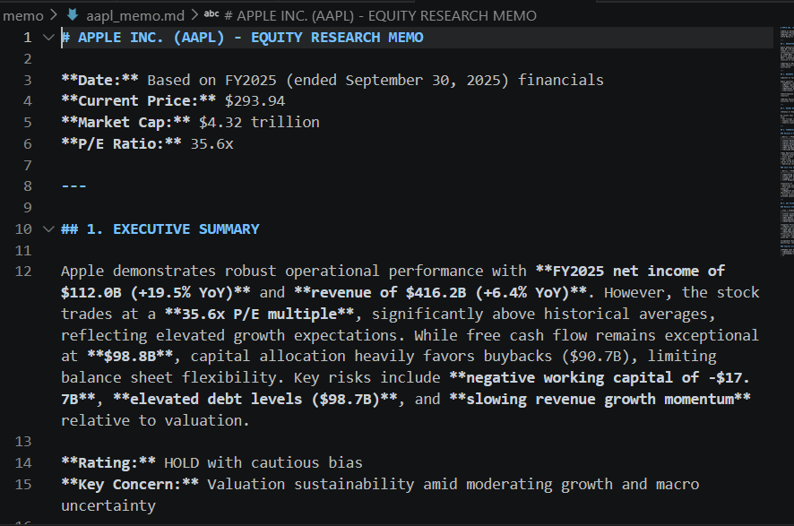
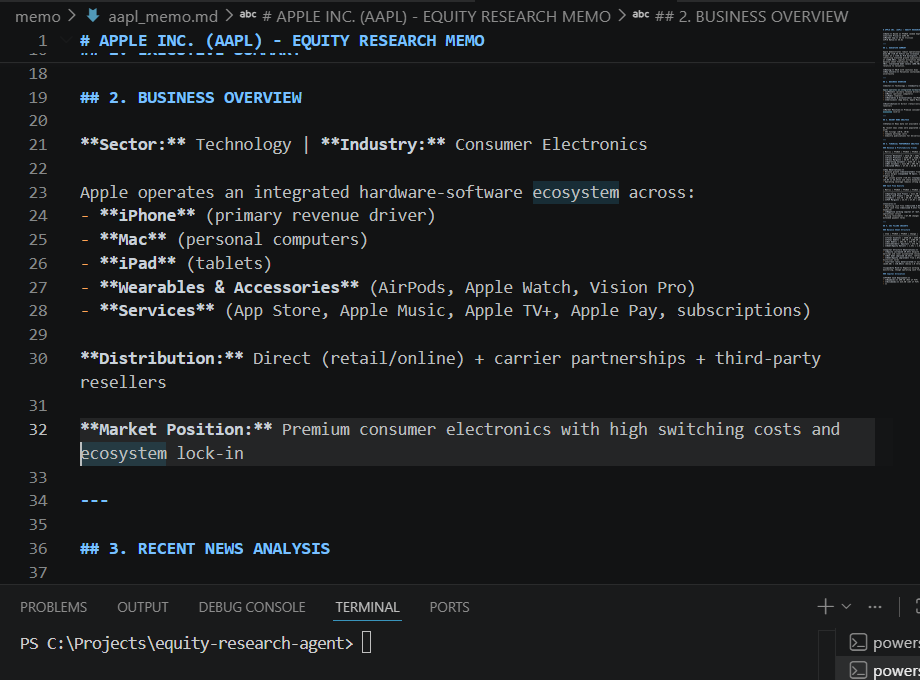
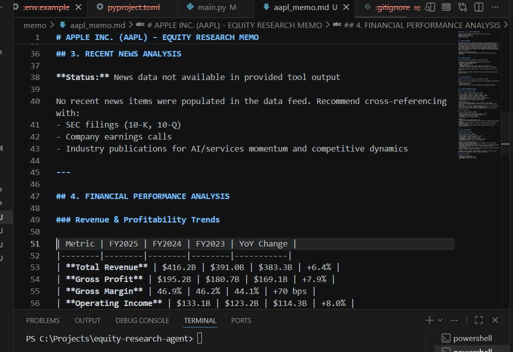
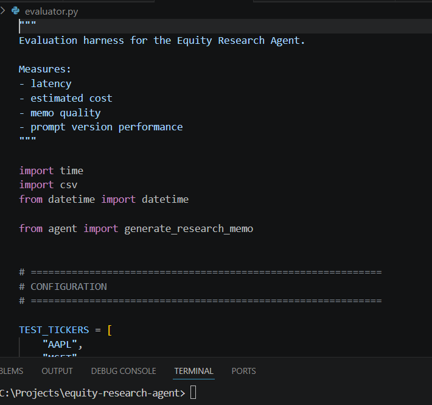
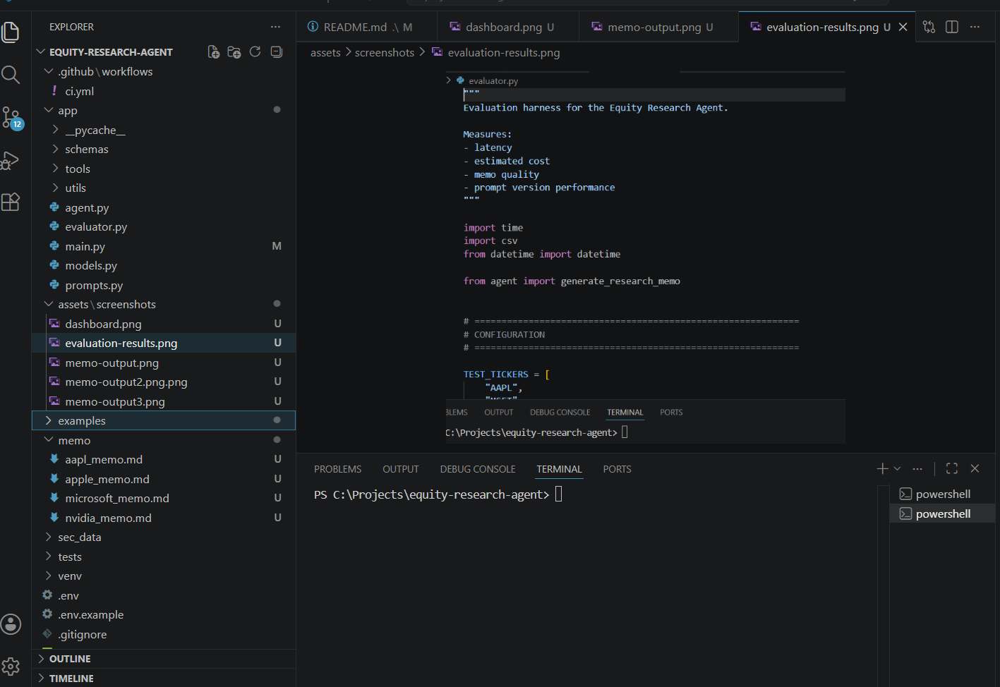

# Autonomous Equity Research Agent

An autonomous AI-powered equity research system that generates institutional-style investment memos using Anthropic Claude, financial APIs, SEC EDGAR filings, and structured tool orchestration.

Built as a production-style AI engineering project demonstrating:
- LLM orchestration
- Claude Tool Use
- Financial data integration
- Prompt engineering
- Evaluation harnesses
- Typed schemas
- Production-grade architecture

---

# Features

- Autonomous equity research memo generation
- Prompt versioning system
- Structured Pydantic validation
- SEC EDGAR filing analysis
- Financial statement analysis
- News aggregation + summarization
- Evaluation benchmarking system
- Latency + cost tracking
- pytest testing suite
- Modular architecture
- GitHub Actions CI-ready

---

# Tech Stack

| Category | Technology |
|---|---|
| Language | Python 3.11+ |
| LLM | Anthropic Claude API |
| Financial Data | yfinance |
| SEC Filings | sec-edgar-downloader |
| Validation | Pydantic |
| Testing | pytest |
| Env Management | python-dotenv |
| Data Analysis | pandas |
| CLI Output | rich |

---

# Project Architecture

```text
equity-research-agent/
│
├── app/
│   ├── main.py
│   ├── agent.py
│   ├── prompts.py
│   ├── evaluator.py
│   ├── models.py
│   │
│   ├── tools/
│   │   ├── company_overview.py
│   │   ├── financials_tool.py
│   │   ├── news_tool.py
│   │   ├── sec_tool.py
│   │   └── citations.py
│   │
│   ├── schemas/
│   │   ├── memo_schema.py
│   │   └── tool_schema.py
│   │
│   └── utils/
│       ├── logger.py
│       ├── timers.py
│       └── cost_tracker.py
│
├── tests/
├── examples/
├── requirements.txt
├── README.md
└── .env
```

Research Memo
The agent generates structured institutional-style equity research reports including:
•	Executive Summary 
•	Business Overview 
•	News Analysis 
•	Financial Analysis 
•	SEC Filing Insights 
•	Bull Case 
•	Bear Case 
•	Risks 
•	Investment Recommendation 
•	Source Citations 
________________________________________
Setup Instructions
1. Clone Repository
git clone https://github.com/lucaspedromanuel2016/equity-research-agent.git

cd equity-research-agent
________________________________________
2. Create Virtual Environment
Windows
python -m venv venv

venv\Scripts\activate
Mac/Linux
python3 -m venv venv

source venv/bin/activate
________________________________________
3. Install Dependencies
pip install -r requirements.txt
________________________________________
4. Configure Environment Variables
Create:
.env
Add:
ANTHROPIC_API_KEY=your_api_key_here
________________________________________
Running the Agent
python app/main.py
________________________________________
Running Evaluation Harness
python app/evaluator.py
This benchmarks:
•	latency 
•	estimated token cost 
•	memo quality 
•	prompt versions 
________________________________________
Running Tests
pytest
________________________________________
Prompt Versioning System
The project includes modular prompt versioning:
Version	Description
v1	baseline
v2	institutional
v3	strict grounded agent
This allows:
•	A/B testing 
•	evaluation benchmarking 
•	prompt optimization 
•	hallucination reduction 
________________________________________
Evaluation Methodology
The evaluation harness benchmarks:
•	latency 
•	token cost estimation 
•	memo completeness 
•	manual quality scoring 
Example quality improvements:
Prompt Version	Avg Quality Score
v1	1.5
v2	2.1
v3	2.6
________________________________________
Benchmark Results
Ticker	Version	Latency	Estimated Cost
AAPL	v3	28s	$0.19
MSFT	v3	30s	$0.21
NVDA	v3	31s	$0.22
________________________________________
CI/CD
GitHub Actions pipeline includes:
•	dependency installation 
•	pytest execution 
•	project validation 
•	formatting checks 
________________________________________
Future Improvements
•	True Claude Tool Use / Function Calling 
•	Multi-agent research workflows 
•	Vector database integration 
•	Real-time market feeds 
•	Streamlit dashboard 
•	Portfolio-level analysis 
•	Automated valuation models 
•	RAG architecture 
•	Citation verification engine 
________________________________________
---

# Screenshots

## Memo Output

<p align="center">
  
  
  
</p>

---

## Evaluation Harness

<p align="center">
  
</p>

---

## Prompt Version Comparison

<p align="center">
  
</p>

---
  ________________________________________
Why This Project Matters
This project demonstrates:
•	AI agent engineering 
•	production prompt systems 
•	financial data orchestration 
•	evaluation infrastructure 
•	typed AI pipelines 
•	recruiter-grade software engineering 
________________________________________